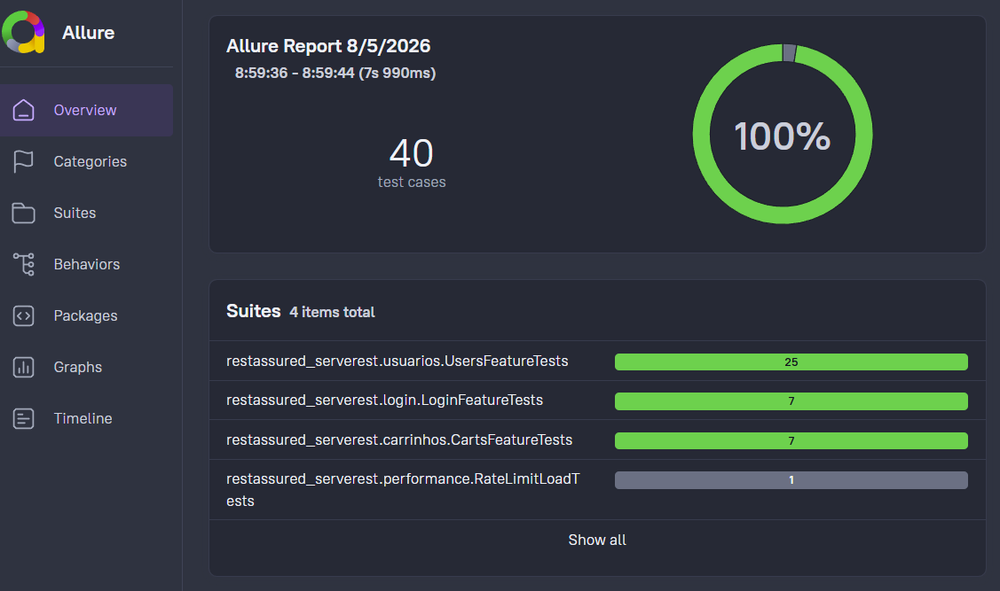

# 🧪 Rest Assured API Testing - ServeRest

[](https://rest-assured.io/)
[](https://junit.org/junit5/)
[](https://www.oracle.com/java/)
[](https://pmd.github.io/)

- Projeto de automação de testes de API utilizando **Rest Assured 6.0.0** e **Java 23** para validar a API REST **ServeRest** — uma plataforma que simula os serviços de um e-commerce.

- Estruturado com boas práticas de engenharia de software (Clean Code, SOLID).
- Relatórios interativos com o **Allure Report**, análise estática de código com **PMD 7** e integração com **GitHub Actions** e relatórios no **GitHub Pages**.


O projeto também inclui:
- ✅ **Validação de contrato JSON Schema** com Rest Assured (`json-schema-validator`)
- ✅ **Teste de carga com JMeter Java DSL** para cenários de limitação de taxa
- ✅ **Logs de execução de carga** em `.jtl` e arquivo de análise (`analysis.log`)

## 📌 Resumo Inicial

### Endpoints testados

- `POST /login`
- `GET, POST, PUT, DELETE /usuarios`
- `GET, POST, DELETE /carrinhos`
- `DELETE /carrinhos/cancelar-compra`
- `POST /produtos`

### Quantidade de testes automatizados (estado atual)

- **30 cenários funcionais** (catalogados com `CTxx`):
    - `LoginFeatureTests`: **5**
    - `UsersFeatureTests`: **18**
    - `CartsFeatureTests`: **7**
- **1 cenário de carga/NFR**:
    - `RateLimitLoadTests`: **1** (execução manual)
- **Total:** **31 cenários automatizados**

**Obs:** No Relatório o total de testes é exibido como **40**, pois alguns cenários possuem **testes parametrizados** (ex.: CT05 - Login com e-mails inválidos).




Para rodar os testes (Observação precisa do Java JDK 23+ e Maven 3.6+):
````bash
git clone https://github.com/reinaldorossetti/serverest_restassured_java.git
cd serverest_restassured_java
mvn clean test
````

- **Relatório dos Testes no GitHub Pages**: [https://reinaldorossetti.github.io/serverest_restassured_java/allure-report/](https://reinaldorossetti.github.io/serverest_restassured_java/allure-report/)

- **Mapeamento dos Testes**: [TESTING_API.MD](TESTING_API.MD)

- **Requisitos do Projeto**: [Requisitos.md](Requisitos.md)

---

## 📚 Índice

- [Sobre o Rest Assured](#-sobre-o-rest-assured)
- [Sobre a API ServeRest](#-sobre-a-api-serverest)
- [Docker](#-docker)
- [Estrutura do Projeto](#-estrutura-do-projeto)
- [Pré-requisitos](#-pré-requisitos)
- [Dependências do Projeto (pom.xml)](#-dependências-do-projeto-pomxml)
- [Instalação e Execução](#-instalação-e-execução)
- [Análise Estática de Código (PMD)](#-análise-estática-de-código-pmd)
- [Esteira CI/CD - GitHub Actions](#-esteira-cicd---github-actions)
- [Exemplos de Testes](#-exemplos-de-testes)
- [Teste de Carga (JMeter DSL)](#-teste-de-carga-jmeter-dsl)
- [Relatórios Allure](#-relatórios-allure)
- [Boas Práticas](#-boas-práticas)

---

## 🧪 Sobre o Rest Assured

**Rest Assured** é uma biblioteca Java open-source amplamente utilizada para automação de testes de APIs REST. 
Ela oferece uma DSL (Domain Specific Language) fluente baseada no padrão BDD `given().when().then()`.

### ✨ Principais Características

- **🔥 DSL Fluente**: Sintaxe `given().when().then()` intuitiva e legível
- **🚀 Suporte completo a REST**: GET, POST, PUT, DELETE com payloads JSON
- **🎯 Assertions com Hamcrest**: Validações estruturais e de schema
- **📊 Integração com Allure**: Logs automáticos de requisições e respostas com `AllureRestAssured`
- **🧪 Data-Driven Testing**: Suporte a testes parametrizados via `@CsvFileSource`
- **⚡ Execução Paralela**: Suporte habilitado via JUnit 5 Platform
- **🔐 Autenticação**: Validação e transmissão de tokens JWT em cabeçalhos HTTP

---

## 🌐 Sobre a API ServeRest

[ServeRest](https://serverest.dev/) é uma API REST gratuita que simula uma loja virtual para fins educacionais e prática de testes de API.

### 🛍️ Endpoints Cobertos

| Recurso | Endpoints | Descrição |
|---------|-----------|-----------|
| **Login** | `POST /login` | Autenticação e geração de token JWT |
| **Usuários** | `GET, POST, PUT, DELETE /usuarios` | Gerenciamento de cadastro de usuários |
| **Carrinhos** | `GET, POST, DELETE /carrinhos` | Fluxo de criação, consulta e conclusão/cancelamento de compra |
| **Produtos** | `POST /produtos` | Cadastro de produtos (cenários autenticados e autorização) |

### 🔗 Base URL
```
https://serverest.dev
```
---

## 🐳 Docker

Este projeto possui suporte para execução local da API ServeRest com Docker e também integração na esteira CI.

### Execução local com Docker Compose

Subir o ambiente:

```bash
docker compose -f docker-compose.serverest.yml up -d
```

Validar se a API está no ar:

```bash
http://localhost:3000
http://localhost:3000/status
```

Encerrar o ambiente:

```bash
docker compose -f docker-compose.serverest.yml down
```

> A URL usada pelos testes é controlada por `BASE_URL_DEV` e `BASE_URL_PROD` no arquivo `.env`.

Comportamento atual:
- `CI=true` (pipeline): usa `BASE_URL_DEV` (fallback: `http://localhost:3000`)
- Execução local: usa `BASE_URL_PROD` (fallback: `https://serverest.dev`)

### Docker na pipeline (GitHub Actions)

Na esteira, o ambiente também sobe via Docker (`docker compose -f docker-compose.serverest.yml up -d`) antes da execução dos testes para garantir previsibilidade e independência de ambientes externos.

---

## 📁 Estrutura do Projeto

```
serverest_restassured_java/
│
├── src/
│   └── test/
│       ├── java/
│       │   └── restassured_serverest/
│       │       ├── BaseApiTest.java               # Configurações base (BaseURI, RequestSpecs, Filtro Allure)
│       │       ├── performance/
│       │       │   └── RateLimitLoadTests.java    # Teste de carga com JMeter DSL + geração de log de análise
│       │       ├── login/
│       │       │   └── LoginFeatureTests.java     # Suíte de testes do recurso Login
│       │       ├── carrinhos/
│       │       │   └── CartsFeatureTests.java     # Suíte de testes do recurso Carrinhos
│       │       ├── usuarios/
│       │       │   └── UsersFeatureTests.java     # Suíte de testes do recurso Usuários
│       │       └── utils/
│       │           └── FakerUtils.java            # Utilitário para geração de dados dinâmicos
│       │
│       └── resources/
│           ├── schemas/
│           │   └── usuarios/
│           │       └── user-by-id-schema.json     # Schema JSON para validação de contrato de usuário
│           └── restassured/
│               └── login/
│                   └── invalid-login-emails.csv   # Massa de dados para teste parametrizado
│
├── pmd-ruleset.xml                               # Regras customizadas da análise estática PMD 7
├── docker-compose.serverest.yml                  # Compose da API ServeRest local/CI
├── pom.xml                                       # Gerenciamento de dependências e plugins Maven
├── Requisitos.md                                 # Especificações dos requisitos do projeto
├── TESTING_API.MD                                # Mapeamento completo dos cenários de teste
└── README.md                                     # Documentação principal
```

---

## 🔧 Pré-requisitos

- **Java JDK 23**
- **Maven 3.6+** (ou o Maven Wrapper `./mvnw` incluso)
- **Docker Desktop** (opcional para rodar o ServeRest localmente)
- **IDE** (VS Code, IntelliJ IDEA ou Eclipse)

---

## 📦 Dependências do Projeto (`pom.xml`)

| Componente | Grupo / Artefato | Versão |
|------------|------------------|--------|
| **Java** | `compiler.source / target` | `23` |
| **Rest Assured** | `io.rest-assured:rest-assured` | `6.0.0` |
| **Rest Assured JSON Schema** | `io.rest-assured:json-schema-validator` | `6.0.0` |
| **JUnit 5** | `org.junit.jupiter:junit-jupiter-api` | `5.10.1` |
| **JUnit Platform** | `org.junit.platform:junit-platform-suite-api` | `1.10.1` |
| **JMeter Java DSL** | `us.abstracta.jmeter:jmeter-java-dsl` | `2.2` |
| **Allure Rest Assured** | `io.qameta.allure:allure-rest-assured` | `2.17.0` |
| **Allure JUnit 5** | `io.qameta.allure:allure-junit5` | `2.17.0` |
| **Java Faker** | `com.github.javafaker:javafaker` | `1.0.2` |
| **Maven PMD Plugin** | `org.apache.maven.plugins:maven-pmd-plugin` | `3.26.0` (PMD 7.7.0) |

---

## 🚀 Instalação e Execução

### 1. Clonar o repositório
```bash
git clone https://github.com/reinaldorossetti/serverest_restassured_java.git
cd serverest_restassured_java
```

### 2. Executar todos os testes
Localmente roda sem docker, mas a pipeline sobe o ServeRest local via Docker Compose antes da execução.
```bash
mvn clean test
```

### 3. Executar uma suíte específica
```bash
mvn "-Dtest=restassured_serverest.usuarios.UsersFeatureTests" test
```

### 4. Executar suíte de login
```bash
mvn "-Dtest=restassured_serverest.login.LoginFeatureTests" test
```

### 5. Subir o ServeRest local com Docker

O projeto possui configuração pronta para executar a API localmente:

```bash
docker compose -f docker-compose.serverest.yml up -d
```

Verifique se a API subiu corretamente:

```bash
http://localhost:3000
http://localhost:3000/status
```

Para parar e remover o container local:

```bash
docker compose -f docker-compose.serverest.yml down
```

> Observação: para CI com Docker use `BASE_URL_DEV=http://localhost:3000`; para execução local mantenha `BASE_URL_PROD=https://serverest.dev`.

---

## 🔍 Análise Estática de Código (PMD)

O projeto conta com validação automatizada de qualidade de código utilizando o **PMD 7.7.0**.

### Executar auditoria com PMD
```bash
mvn pmd:check
```

- **Arquivo de Regras Customizado**: [`pmd-ruleset.xml`](pmd-ruleset.xml)
- **Relatório de Saída**: `target/pmd.xml`

---

## ⚙️ Esteira CI/CD - GitHub Actions

A integração contínua é executada automaticamente no GitHub Actions através do workflow `.github/workflows/rest-assured-api-pipeline.yml`.

### Passos da Esteira:
1. Checkout do código-fonte.
2. Subida da API local via Docker Compose.
3. Configuração do ambiente **Java 23**.
4. Execução dos testes automatizados via Maven.
5. Geração do relatório **Allure Report** e PDF.
6. Upload de artefatos, envio de e-mail e publicação automática no **GitHub Pages**.

---

## 📝 Exemplos de Testes

### Exemplo 1: Configuração Base (`BaseApiTest`)

```java
public abstract class BaseApiTest {

    public static final String ROTA_USUARIOS = "/usuarios";
    public static final String ROTA_LOGIN = "/login";

    protected RequestSpecification givenWithAllure() {
        return RestAssured.given().filter(new AllureRestAssured());
    }

    @BeforeAll
    static void setupRestAssured() {
        final boolean isCi = "true".equalsIgnoreCase(System.getenv("CI"));
        final String devUrl = DOTENV.get("BASE_URL_DEV");
        final String prodUrl = DOTENV.get("BASE_URL_PROD");

        if (isCi) {
            RestAssured.baseURI = devUrl != null && !devUrl.isBlank() ? devUrl : "http://localhost:3000";
        } else {
            RestAssured.baseURI = prodUrl != null && !prodUrl.isBlank() ? prodUrl : "https://serverest.dev";
        }
    }
}
```

### Exemplo 2: Teste de Login com Sucesso (`LoginFeatureTests`) usando `Map`

```java
@Test
@DisplayName("CT01 - Login com credenciais válidas")
void loginWithValidCredentials() {
    final String userEmail = FakerUtils.randomEmail();
    final String userPassword = DEFAULT_PASSWORD;

    createUser(userEmail, userPassword, false)
            .then()
            .statusCode(201);

    final Map<String, Object> loginPayload = Map.of(
        KEY_EMAIL, userEmail,
        KEY_PASSWORD, userPassword
    );

    givenWithAllure()
            .contentType(ContentType.JSON)
            .basePath(ROTA_LOGIN)
        .body(loginPayload)
            .when()
            .post()
            .then()
            .statusCode(200)
            .body(KEY_MESSAGE, equalTo("Login realizado com sucesso"))
        .body("authorization", notNullValue());
}
```

### Exemplo 3: Teste Parametrizado com CSV (`LoginFeatureTests`) usando `Map`

```java
@ParameterizedTest(name = "CT05 - Validar e-mail com formato inválido: {0}")
@CsvFileSource(resources = "/restassured/login/invalid-login-emails.csv", numLinesToSkip = 1)
@DisplayName("CT05 - Validação de formato de e-mail inválido")
void validateInvalidEmailFormat(String invalidEmail) {
    final Map<String, Object> payload = Map.of(
        KEY_EMAIL, invalidEmail,
        KEY_PASSWORD, "senha123"
    );

    givenWithAllure()
            .contentType(ContentType.JSON)
            .basePath(ROTA_LOGIN)
        .body(payload)
            .when()
            .post()
            .then()
            .statusCode(400)
        .body(KEY_EMAIL, notNullValue());
}
```

### Exemplo 4: Validação de JSON Schema (`UsersFeatureTests`)

```java
givenWithAllure()
    .basePath(ROTA_USUARIOS + "/" + userId)
    .when()
    .get()
    .then()
    .statusCode(200)
    .body(matchesJsonSchemaInClasspath("schemas/usuarios/user-by-id-schema.json"));
```

---

## ⚡ Teste de Carga (JMeter DSL)

O projeto possui o teste `RateLimitLoadTests` para simulação de carga no endpoint `/usuarios`.

### Como executar manualmente

> O teste está marcado com `@Disabled` por padrão (NFR), então execute com a condição desativada no JUnit:

```bash
mvn "-Dtest=restassured_serverest.performance.RateLimitLoadTests" "-Djunit.jupiter.conditions.deactivate=org.junit.*DisabledCondition" test
```

### Artefatos de log gerados

- **JTL de amostras**: `target/jmeter-jtls/rate-limit/*.jtl`
- **Resumo de análise**: `target/jmeter-jtls/rate-limit/analysis.log`

O `analysis.log` inclui timestamp, arquivo JTL utilizado, total de amostras, contagem de `429`, contagem de `5xx` e distribuição de códigos HTTP.

---

## 📊 Relatórios Allure

Para gerar e abrir o relatório visual localmente após a execução dos testes:

```bash
mvn allure:serve
```

O relatório interativo exibe:
- Status de aprovação dos testes.
- Anexo completo de requisições e respostas HTTP (corpo, headers, status code).
- Gráficos de tempo de execução e cobertura das suítes.

---

## 🎓 Boas Práticas Aplicadas

1. **Separação por Recurso**: Suítes isoladas por domínio (`UsersFeatureTests`, `CartsFeatureTests`, `LoginFeatureTests`).
2. **Dados Dinâmicos**: Uso de [FakerUtils.java](file:///d:/github-projects/serverest_restassured_java/src/test/java/restassured_serverest/utils/FakerUtils.java) para gerar massas de teste sem causar colisões.
3. **Padrão DRY (Don't Repeat Yourself)**: Reutilização de especificações na classe base [BaseApiTest.java](file:///d:/github-projects/serverest_restassured_java/src/test/java/restassured_serverest/BaseApiTest.java).
4. **Payloads tipados**: Uso de `Map`/`List` ao invés de JSON manual em `String`, reduzindo erros de serialização.
5. **Respeito aos Princípios SOLID & Clean Code**: Métodos pequenos, tipagem estrita e nomes descritivos.
6. **Validação de contrato**: Uso de JSON Schema para garantir conformidade estrutural das respostas.
7. **Testes NFR isolados**: Carga executada manualmente via JMeter DSL, sem impactar a suíte funcional padrão.
8. **Rastreabilidade de carga**: Persistência de logs (`.jtl` + `analysis.log`) para análise posterior.

9. **Validações de API**: Seguindo as melhores práticas de validação de APIs REST, conforme detalhado neste artigo:
https://reiload-88128.medium.com/quais-validações-devo-realizar-em-uma-api-postman-ca99eeae81dd

---

## 👨‍💻 Autor

Desenvolvido por **Reinaldo Rossetti** para automação de testes de API REST em Java.